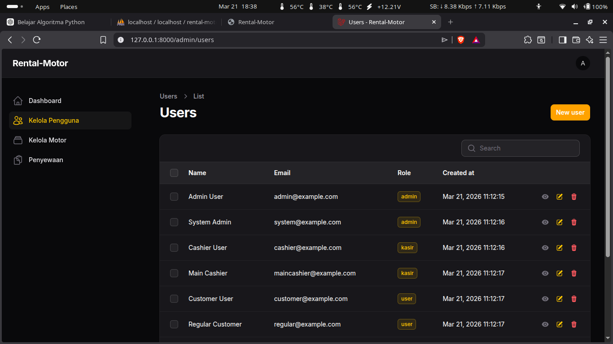

# Aplikasi Rental Motor Berbasis Web

<div align="center">


**Sistem Manajemen Rental Motor dengan Multi-User Role**

[Fitur Utama](#-fitur-utama) • [Teknologi](#-teknologi-yang-digunakan) • [Instalasi](#-instalasi) • [Struktur Database](#-struktur-database) • [Screenshots](#-screenshots)

</div>

---

## 📋 Daftar Isi

- [Tentang Aplikasi](#-tentang-aplikasi)
- [Fitur Utama](#-fitur-utama)
- [Teknologi yang Digunakan](#-teknologi-yang-digunakan)
- [Role User](#-role-user)
- [Instalasi](#-instalasi)
- [Konfigurasi Environment](#-konfigurasi-environment)
- [Database Seeder](#-database-seeder)
- [Struktur Database](#-struktur-database)
- [Struktur Folder](#-struktur-folder)
- [Routes](#-routes)
- [Screenshots](#-screenshots)
- [Default Login Credentials](#-default-login-credentials)

---

## 📖 Tentang Aplikasi

Aplikasi Rental Motor adalah sistem manajemen rental motor berbasis web yang dibangun menggunakan **Laravel 12** dan **Filament Admin Panel**. Sistem ini dirancang untuk memudahkan pengelolaan bisnis rental motor dengan mendukung **multi-user role** (Admin, Kasir, dan User).

Aplikasi ini menyediakan fitur lengkap untuk pengelolaan data motor, transaksi penyewaan, konfirmasi pembayaran, laporan, dan ulasan pelanggan dengan antarmuka yang modern dan responsif.

---

## ✨ Fitur Utama

### 🎯 Admin Dashboard (Filament Admin Panel)

#### Kelola Pengguna
- ✅ Tambah akun baru untuk kasir dan user
- ✅ Lihat semua pengguna yang terdaftar
- ✅ Edit dan hapus akun pengguna
- ✅ Manajemen role-based access (Admin, Kasir, User)

#### Kelola Daftar Motor
- ✅ Tambah unit motor baru dengan foto
- ✅ Edit informasi motor (merk, model, plat nomor, harga)
- ✅ Hapus unit motor dari sistem
- ✅ Update status motor (Tersedia, Disewa, Perawatan)
- ✅ Upload dan manajemen gambar motor

#### Manajemen Transaksi
- ✅ Lihat seluruh transaksi penyewaan
- ✅ Monitor status pembayaran (Pending, Dibayar, Selesai, Dibatalkan)
- ✅ Filter transaksi berdasarkan status
- ✅ Lihat detail penyewa dan motor yang disewa

#### Kelola Ulasan
- ✅ Pantau ulasan dari pelanggan
- ✅ Moderasi ulasan (view-only)
- ✅ Lihat rating dan komentar pelanggan

---

### 💼 Kasir Dashboard (Filament Panel)

#### Mengelola Pembayaran
- ✅ Konfirmasi penyewaan dan pembayaran pelanggan
- ✅ Ubah status transaksi dari Pending → Dibayar
- ✅ Tandai transaksi sebagai Selesai
- ✅ Batalkan transaksi jika diperlukan

#### Melihat Status Sewa
- ✅ Lihat riwayat penyewaan aktif
- ✅ Monitor status peminjaman motor pelanggan
- ✅ Filter transaksi berdasarkan status
- ✅ Lihat foto motor dan detail penyewa

#### Aksi Cepat
- ✅ **Konfirmasi**: Setujui pembayaran dan ubah status motor menjadi "Disewa"
- ✅ **Selesaikan**: Tandai sewa selesai dan kembalikan motor ke "Tersedia"
- ✅ **Batalkan**: Batalkan transaksi dan kembalikan motor ke "Tersedia"

---

### 👤 User Dashboard (Blade View)

#### Melihat Daftar Motor
- ✅ Jelajahi motor yang tersedia untuk disewa
- ✅ Lihat foto, spesifikasi, dan harga rental
- ✅ Filter motor berdasarkan status ketersediaan
- ✅ Interface responsif dan user-friendly

#### Membuat Pesanan Sewa
- ✅ Pilih tanggal mulai dan akhir sewa
- ✅ Kalkulasi otomatis total harga berdasarkan durasi
- ✅ Integrasi WhatsApp untuk konfirmasi cepat
- ✅ Simpan pesanan ke sistem dengan status "Pending"

#### Manajemen Sewa Saya
- ✅ Lihat riwayat penyewaan pribadi
- ✅ Monitor status sewa (Pending, Aktif, Selesai)
- ✅ Lihat detail motor yang sedang/telah disewa

#### Memberikan Ulasan
- ✅ Tulis ulasan setelah penyewaan selesai
- ✅ Berikan rating untuk layanan
- ✅ Tambahkan komentar dan feedback

---

## 🛠 Teknologi yang Digunakan

| Kategori | Teknologi |
|----------|-----------|
| **Framework** | Laravel 12 |
| **Admin Panel** | Filament Admin 3.3 |
| **Backend** | PHP 8.2+ |
| **Database** | MySQL |
| **Frontend** | Blade Templates |
| **CSS Framework** | Tailwind CSS |
| **JavaScript** | Alpine.js, Vite |
| **Authentication** | Laravel Breeze |
| **Testing** | Pest PHP |

### Dependencies Utama

```json
{
  "require": {
    "php": "^8.2",
    "filament/filament": "^3.3",
    "laravel/framework": "^12.0"
  },
  "require-dev": {
    "laravel/breeze": "^2.3",
    "pestphp/pest": "^3.8"
  }
}
```

---

## 👥 Role User

| Role | Akses Panel | Deskripsi |
|------|-------------|-----------|
| **Admin** | Admin Panel | Akses penuh ke semua fitur: Kelola user, motor, transaksi, dan ulasan |
| **Kasir** | Kasir Panel | Mengelola pembayaran dan status sewa |
| **User** | User Dashboard | Menyewa motor, melihat riwayat, memberikan ulasan |

### Access Control

```php
// User Model - canAccessPanel
public function canAccessPanel(Panel $panel): bool
{
    return match ($panel->getId()) {
        'admin' => $this->role === 'admin',
        'kasir' => $this->role === 'kasir',
        default => false,
    };
}
```

---

## 🚀 Instalasi

### Prasyarat
- PHP >= 8.2
- Composer
- Node.js & NPM
- MySQL/MariaDB
- Git

### Langkah Instalasi

1. **Clone Repository**
```bash
git clone <repository-url>
cd project-rental-motor
```

2. **Install Dependencies**
```bash
composer install
npm install
```

3. **Setup Environment**
```bash
cp .env.example .env
php artisan key:generate
```

4. **Konfigurasi Database**
Edit file `.env` sesuai konfigurasi database Anda:
```env
DB_CONNECTION=mysql
DB_HOST=127.0.0.1
DB_PORT=3306
DB_DATABASE=rental-motor
DB_USERNAME=root
DB_PASSWORD=your_password
```

5. **Migrate Database**
```bash
php artisan migrate
```

6. **Seed Data (Optional)**
```bash
php artisan db:seed
```

7. **Create Storage Link**
```bash
php artisan storage:link
```

8. **Build Assets**
```bash
npm run build
# atau untuk development
npm run dev
```

9. **Run Application**
```bash
php artisan serve
```

Aplikasi akan berjalan di `http://127.0.0.1:8000`

---

## ⚙️ Konfigurasi Environment

### File `.env` Configuration

```env
APP_NAME=Rental-Motor
APP_ENV=local
APP_DEBUG=true
APP_URL=http://127.0.0.1:8000
APP_LOCALE=en

# Database
DB_CONNECTION=mysql
DB_HOST=127.0.0.1
DB_PORT=3306
DB_DATABASE=rental-motor
DB_USERNAME=root
DB_PASSWORD=your_password

# Session
SESSION_DRIVER=database
SESSION_LIFETIME=120

# Cache & Queue
CACHE_STORE=database
QUEUE_CONNECTION=database

# File Storage
FILESYSTEM_DISK=public

# Mail (Optional)
MAIL_MAILER=log
MAIL_HOST=127.0.0.1
MAIL_PORT=2525
```

---

## 🌱 Database Seeder

Aplikasi ini dilengkapi dengan seeder untuk membuat user default:

### AdminUserSeeder
- `Admin User` - admin@example.com
- `System Admin` - system@example.com

### CashierUserSeeder
- Kasir default untuk testing

### CustomerUserSeeder
- User/customer default untuk testing

**Jalankan Seeder:**
```bash
php artisan db:seed
```

---

## 🗄 Struktur Database

### Tabel Utama

#### `users`
| Column | Type | Description |
|--------|------|-------------|
| id | bigint | Primary key |
| name | string | Nama user |
| email | string | Email (unique) |
| password | string | Hashed password |
| role | enum | admin/kasir/user |
| created_at | timestamp | Waktu pembuatan |
| updated_at | timestamp | Waktu update |

#### `motors`
| Column | Type | Description |
|--------|------|-------------|
| id | bigint | Primary key |
| brand | string | Merk motor |
| model | string | Model motor |
| plate_number | string | Nomor plat |
| description | text | Deskripsi |
| rental_price_per_day | decimal | Harga sewa per hari |
| status | enum | available/rented/maintenance |
| image | string | Path gambar |
| created_at | timestamp | Waktu pembuatan |
| updated_at | timestamp | Waktu update |

#### `rentals`
| Column | Type | Description |
|--------|------|-------------|
| id | bigint | Primary key |
| user_id | bigint | Foreign key to users |
| motor_id | bigint | Foreign key to motors |
| start_date | date | Tanggal mulai sewa |
| end_date | date | Tanggal akhir sewa |
| total_price | decimal | Total harga (auto-calculated) |
| status | enum | pending/confirmed/completed/cancelled |
| created_at | timestamp | Waktu pembuatan |
| updated_at | timestamp | Waktu update |

#### `reviews`
| Column | Type | Description |
|--------|------|-------------|
| id | bigint | Primary key |
| rental_id | bigint | Foreign key to rentals |
| user_id | bigint | Foreign key to users |
| rating | integer | Rating 1-5 |
| comment | text | Komentar ulasan |
| created_at | timestamp | Waktu pembuatan |
| updated_at | timestamp | Waktu update |

### Entity Relationship

```
┌─────────────┐       ┌─────────────┐
│    users    │       │   motors    │
├─────────────┤       ├─────────────┤
│ id          │       │ id          │
│ name        │       │ brand       │
│ email       │       │ model       │
│ role        │       │ plate_number│
└──────┬──────┘       └──────┬──────┘
       │                     │
       │  ┌─────────────┐    │
       └──┤   rentals   ├──┘
          ├─────────────┤
          │ id          │
          │ user_id (FK)│
          │ motor_id(FK)│
          │ start_date  │
          │ end_date    │
          │ total_price │
          │ status      │
          └──────┬──────┘
                 │
                 │  ┌─────────────┐
                 └──┤   reviews   │
                    ├─────────────┤
                    │ rental_id   │
                    │ user_id     │
                    │ rating      │
                    │ comment     │
                    └─────────────┘
```

---

## 📁 Struktur Folder

```
project-rental-motor/
├── app/
│   ├── Console/
│   ├── Filament/
│   │   ├── Kasir/
│   │   │   └── Resources/
│   │   │       ├── RentalResource.php
│   │   │       └── StatusSewaResource.php
│   │   └── Resources/
│   │       ├── MotorResource.php
│   │       ├── RentalResource.php
│   │       ├── ReviewResource.php
│   │       └── UserResource.php
│   ├── Http/
│   │   ├── Controllers/
│   │   │   ├── Auth/
│   │   │   ├── User/
│   │   │   │   └── RentalController.php
│   │   │   ├── DashboardController.php
│   │   │   ├── ProfileController.php
│   │   │   └── ReviewController.php
│   │   └── Middleware/
│   ├── Models/
│   │   ├── Motor.php
│   │   ├── Rental.php
│   │   ├── Review.php
│   │   └── User.php
│   ├── Providers/
│   └── View/
├── database/
│   ├── factories/
│   ├── migrations/
│   │   ├── 0001_01_01_000000_create_users_table.php
│   │   ├── 2025_05_28_165316_create_motors_table.php
│   │   ├── 2025_05_31_165326_create_rentals_table.php
│   │   ├── 2025_06_02_005839_create_reviews_table.php
│   │   └── 2025_06_02_060237_add_image_to_motors_table.php
│   └── seeders/
│       ├── AdminUserSeeder.php
│       ├── CashierUserSeeder.php
│       ├── CustomerUserSeeder.php
│       └── DatabaseSeeder.php
├── resources/
│   ├── views/
│   │   ├── auth/
│   │   ├── components/
│   │   ├── layouts/
│   │   ├── profile/
│   │   ├── dashboard.blade.php
│   │   └── welcome.blade.php
│   ├── css/
│   └── js/
├── routes/
│   ├── web.php
│   ├── auth.php
│   └── console.php
└── public/
```

---

## 🛣 Routes

### Public Routes
```php
GET  /                          → Welcome page
POST /sewa/{motor}              → Submit rental order (sewa.store)
```

### Authenticated Routes
```php
GET  /dashboard                 → User dashboard (daftar motor)
GET  /profile                   → Edit profile
PATCH /profile                  → Update profile
DELETE /profile                 → Delete account
```

### Auth Routes (Laravel Breeze)
```php
GET  /register                  → Registration form
POST /register                  → Store registration
GET  /login                     → Login form
POST /login                     → Authenticate
GET  /forgot-password           → Request password reset
POST /forgot-password           → Send reset link
GET  /reset-password/{token}    → Reset password form
POST /reset-password            → Store new password
POST /logout                    → Logout user
```

### Admin Panel Routes (Filament)
```
/admin                          → Admin dashboard
/admin/motors                   → Kelola motor
/admin/users                    → Kelola pengguna
/admin/rentals                  → Penyewaan
/admin/reviews                  → Ulasan
```

### Kasir Panel Routes (Filament)
```
/kasir                          → Kasir dashboard
/kasir/rentals                  → Daftar sewa
/kasir/status-sewa              → Status sewa
```

---

## 📸 Screenshots

> **📍 Lokasi Screenshots:** `public/screenshots/`
> 
> **✅ Untuk GitHub:**
> 1. Simpan semua screenshots di folder `public/screenshots/`
> 2. Commit dan push ke GitHub:
>    ```bash
>    git add public/screenshots/
>    git commit -m "Add screenshots"
>    git push
>    ```
> 3. Gambar akan otomatis tampil di README GitHub

> **💡 Untuk Local Development:**
> - Akses di: `http://localhost:8000/screenshots/nama-file.png`

---

> **Note:** Bagian ini berisi placeholder untuk screenshots interface aplikasi. Silakan tambahkan screenshot actual dari aplikasi Anda.

### Landing Page & Authentication

#### 🏠 Welcome Page (Homepage)
```
📸 Screenshot: resources/screenshots/welcome-page.png
```
*Halaman welcome/landing page dengan desain modern dan responsive*

---

#### 🔐 Login Page
```
📸 Screenshot: resources/screenshots/auth-login.png
```
*Halaman login untuk semua role user dengan form email dan password*

---

#### 📝 Register Page
```
📸 Screenshot: resources/screenshots/auth-register.png
```
*Halaman registrasi untuk user baru*

---

### User Dashboard

#### 🎯 User Dashboard - Daftar Motor
```
📸 Screenshot: resources/screenshots/user-dashboard-motors.png
```
*Tampilan daftar motor yang tersedia untuk disewa dengan grid layout responsive*

**Fitur yang terlihat:**
- Grid card layout untuk motor
- Foto motor dengan kualitas baik
- Informasi: merk, model, deskripsi, harga/hari
- Tombol "Sewa Sekarang" dengan integrasi WhatsApp
- Status ketersediaan motor

---

#### 📋 My Rentals - Riwayat Sewa
```
📸 Screenshot: resources/screenshots/user-my-rentals.png
```
*Halaman riwayat penyewaan user dengan status transaksi*

**Fitur yang terlihat:**
- List semua penyewaan user
- Status: Pending, Confirmed, Completed, Cancelled
- Detail motor dan tanggal sewa
- Total harga

---

#### ⭐ Review Form
```
📸 Screenshot: resources/screenshots/user-review-form.png
```
*Form untuk memberikan ulasan dan rating setelah penyewaan selesai*

---

### Admin Panel

#### 📊 Admin Dashboard Overview
```
📸 Screenshot: resources/screenshots/admin-dashboard-overview.png
```
*Dashboard admin dengan statistik dan quick overview*

---

#### 👥 Kelola Pengguna (User Management)



*Halaman manajemen pengguna dengan tabel interaktif*

**Fitur yang terlihat:**
- Tabel daftar semua user
- Search dan filter
- Action buttons: View, Edit, Delete
- Badge role dengan warna berbeda (Admin=green, Kasir=yellow, User=gray)
- Tombol "Create User" untuk menambah user baru

---

#### ➕ Create User Form
```
📸 Screenshot: resources/screenshots/admin-create-user.png
```
*Form tambah user baru dengan field name, email, role, dan password*

---

#### 🏍 Kelola Motor (Motor Management)
```
📸 Screenshot: resources/screenshots/admin-motor-management.png
```
*Halaman manajemen motor dengan foto dan detail unit*

**Fitur yang terlihat:**
- Tabel motor dengan kolom foto
- Informasi: merk, model, plat nomor, harga/hari, status
- Status badge: Tersedia (green), Disewa (blue), Perawatan (orange)
- Action buttons: View, Edit, Delete
- Harga dalam format Rupiah (Rp)

---

#### ➕ Create/Edit Motor Form
```
📸 Screenshot: resources/screenshots/admin-motor-form.png
```
*Form tambah/edit motor dengan upload gambar*

**Field yang terlihat:**
- Brand/Merk (text input)
- Model (text input)
- Plat Nomor (text input)
- Deskripsi (textarea)
- Harga/Hari (numeric input)
- Status dropdown (Tersedia/Disewa/Perawatan)
- Upload Foto Motor (file upload dengan preview)

---

#### 📋 Penyewaan (Rentals Management)
```
📸 Screenshot: resources/screenshots/admin-rentals.png
```
*Halaman manajemen transaksi penyewaan*

**Fitur yang terlihat:**
- Tabel transaksi dengan nama pelanggan dan detail motor
- Status badge dengan warna:
  - Pending (blue)
  - Dibayar/Confirmed (green)
  - Selesai/Completed (yellow)
  - Dibatalkan/Cancelled (red)
- Filter berdasarkan status

---

#### ⭐ Ulasan (Reviews Management)
```
📸 Screenshot: resources/screenshots/admin-reviews.png
```
*Halaman monitoring ulasan dari pelanggan*

---

### Kasir Panel

#### 💼 Kasir Dashboard - Daftar Sewa
```
📸 Screenshot: resources/screenshots/kasir-daftar-sewa.png
```
*Dashboard kasir dengan daftar transaksi yang perlu dikonfirmasi*

**Fitur yang terlihat:**
- Tabel transaksi dengan foto motor
- Nama penyewa
- Merk dan model motor
- Status pembayaran

---

#### ✅ Konfirmasi Pembayaran
```
📸 Screenshot: resources/screenshots/kasir-konfirmasi-pembayaran.png
```
*Tampilan aksi konfirmasi pembayaran dengan buttons:*

**Action Buttons:**
- ✅ **Konfirmasi** (green) - Setujui pembayaran, status → Confirmed
- ❌ **Batalkan** (red) - Batalkan transaksi, status → Cancelled
- ✔️ **Selesai** (yellow) - Tandai selesai, status → Completed

---

#### 📊 Status Sewa
```
📸 Screenshot: resources/screenshots/kasir-status-sewa.png
```
*Halaman monitoring status sewa aktif*

**Fitur yang terlihat:**
- Filter berdasarkan status
- Foto motor circular
- Detail pelanggan dan motor
- Timeline/status tracking

---

### Profile Management

#### 👤 Edit Profile
```
📸 Screenshot: resources/screenshots/profile-edit.png
```
*Halaman edit profil user*

---

#### 🔒 Update Password
```
📸 Screenshot: resources/screenshots/profile-password.png
```
*Form update password*

---

#### ⚠️ Delete Account
```
📸 Screenshot: resources/screenshots/profile-delete.png
```
*Form konfirmasi hapus akun*

---

### Responsive Design

#### 📱 Mobile View
```
📸 Screenshot: resources/screenshots/mobile-view.png
```
*Tampilan aplikasi pada perangkat mobile (responsive)*

---

## 🔐 Default Login Credentials

Setelah menjalankan seeder, gunakan credentials berikut untuk login:

### Admin Account
| Email | Password | Role |
|-------|----------|------|
| admin@example.com | password | Admin |
| system@example.com | password | Admin |

### Kasir Account
| Email | Password | Role |
|-------|----------|------|
| kasir@example.com | password | Kasir |

### User Account
| Email | Password | Role |
|-------|----------|------|
| user@example.com | password | User |

> ⚠️ **PENTING:** Segera ubah password default setelah instalasi pertama kali!

---

## 🎨 Fitur Tambahan

### Auto Calculate Total Price
Sistem otomatis menghitung total harga sewa berdasarkan:
```php
total_price = rental_price_per_day × lama_hari
```
Dimana `lama_hari` dihitung dari selisih `start_date` dan `end_date`.

### WhatsApp Integration
Tombol "Sewa Sekarang" mengintegrasikan dengan WhatsApp untuk konfirmasi cepat:
```php
$message = "Halo, saya {nama} ingin menyewa motor {merk} {model} ...";
$whatsappLink = "https://wa.me/?text=" . urlencode($message);
```

### Status Motor Auto-Update
- Saat kasir konfirmasi → motor status = `rented`
- Saat sewa selesai/dibatalkan → motor status = `available`

---

## 🧪 Testing

Jalankan test suite menggunakan Pest:
```bash
npm run test
# atau
php artisan test
```

---

## 📝 License

Aplikasi ini open-sourced software licensed under the [MIT license](https://opensource.org/licenses/MIT).

---

## 🤝 Kontribusi

Terima kasih atas kontribusi Anda untuk pengembangan aplikasi ini!

---

<div align="center">

**Aplikasi Rental Motor Berbasis Web**

Dibuat dengan ❤️ menggunakan Laravel & Filament

</div>
